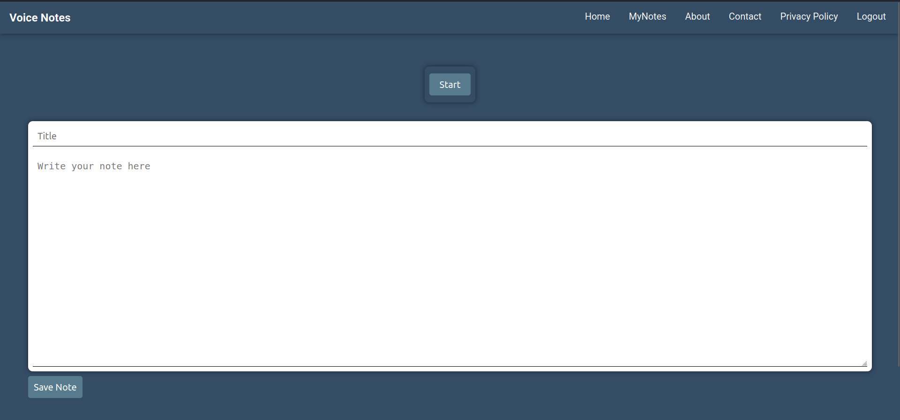

# Voice Note App
## Introduction
This is a Django-based web application that allows users to create and view voice notes. The application ensures that users can only view their notes if they have any saved and provides functionality for creating new notes.

#### Home Page 


## Features
The Voice Notes app has the following features.

    - User authentication
    - Create and view notes
    - Conditional rendering based on whether the user has saved notes

## Prerequisites
    - Python 3.x
    - Django 5.x or later
    - Chromium Based Browser

## Setup

1. **Clone the repository:**

    ```bash
    git clone https://github.com/santoshvandari/VoiceNotes.git
    cd VocieNotes
    ```

2. **Create and activate a virtual environment:**

   ```Bash
    python3 -m virtualenv venv #For Linux User
    source venv/bin/activate  
    ``` 
    Note: It is not Necessary to Create Virtual Environment but recommanded.

3. **Install the required packages:**

    ```bash
    pip install -r requirements.txt
    ```

4. **Set up the Django project:**

    ```bash
    python3 manage.py makemigrations
    python3 manage.py migrate
    ```

5. **Run the development server:**

    ```bash
    python manage.py runserver
    ```

8. **Access the application:**

    Open your browser and go to `http://127.0.0.1:8000/`.

## Usage

1. **Register and Log In:**

    - Register a new user or log in with an existing user account.

2. **Create a Note:**

    - Navigate to the "Home" page.
    - Enter a title and content for your note.
    - Save the note.

3. **View Notes:**

    - If you have saved notes, you can view them on the "Your Notes" page.
    - If you do not have any saved notes, you will be redirected to a page informing you that you have no notes.


## Contributing
We welcome contributions! If you'd like to contribute to this Voice Notes app, please check out our [Contribution Guidelines](Contribution.md).

## Code of Conduct
Please review our [Code of Conduct](CodeOfConduct.md) before participating in this app.

## License
This project is licensed under the [License](LICENSE).


#### Keep Smiling & Enjoy Coding